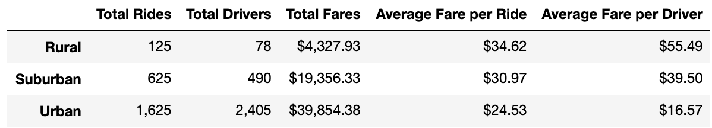
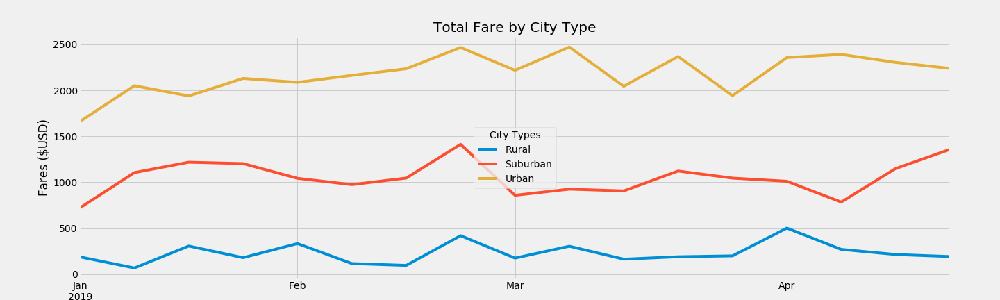

# PyBer_Analysis

## Challenge Analysis
The goal of this assignment was to analyze ride sharing data from PyBer in order to identify trends in ride shares broken down by city type (urban, suburban, or rural) in order to help executives make key decisions on business direction. This data was analyzed using the Matplotlib, Pandas, and NumPy libraries within Python and was analyzed using [Jupyter Notebook](PyBer.ipynb). First, I generated a [summary table](analysis/ChallengeSummaryTable.png) (shown below) with key metrics summarized between the different city types. This analysis showed that the volume of rides, drivers, and fares were much higher in Urban areas; however, the average fares per ride were marginally higher in rural areas. In all cases suburban cities were in between urban and rural. Second, I generated a [graph](analysis/ChallengeFig1.png) (shown below) tracked total fares over time (averaged over a week) for the three city types from January through April 2019. This analysis showed that the weekly fares were consistently higher in urban cities than suburban or rural cities and that no city type showed a strong variation in fares over time.

There were numerous challenges in this analysis. One of the most prominent was translating the data from individual rides with specific timestamps to a summary where the sum of all rides for a given week could be tracked. This would have been exceptionally time consuming to do manually but with the resample function in python it became just one simple line of code. This took the time aspect of the data from detailed but unhelpful to a high level informative summary that would provide key insight and could be used to draw important conclusions.

Based on this analysis, the bulk of PyBer's business is coming from Urban cities. As the core of their business, they should continue to invest in these locations. For Urban cities, the data suggests there are more drivers than their are rides--thus I would focus efforts on user/rider recruitment in these areas. While suburban and rural cities are not currently a large part of PyBer's business, this means that there is room to grow with these types of cities. In these cities, there are more rides than there are drivers, suggesting demand is there. Thus, in these cities, I would focus on driver recruitment. In rural areas in particular, the high average fare per driver could be used to attract new drivers to the business. Two additional analyses that would be informative would be:
1. Comparing fare per ride, distance per ride, and number of drivers for each city (colored by city type) in a bubble plot. This would help PyBer determine the underlying cause for differences in fares (longer rides or not enough drivers causing surge pricing). This would involve obtaining another dataset with this information and then merging it with our dataset and creating a bubble chart as done in the module.
2. Line charts plotted by day of week and time of day so PyBer can determine what times of day people are using their service. This would involve separating out the Date data and resampling either by day or week or by hour and summing up all the rides in that range.
